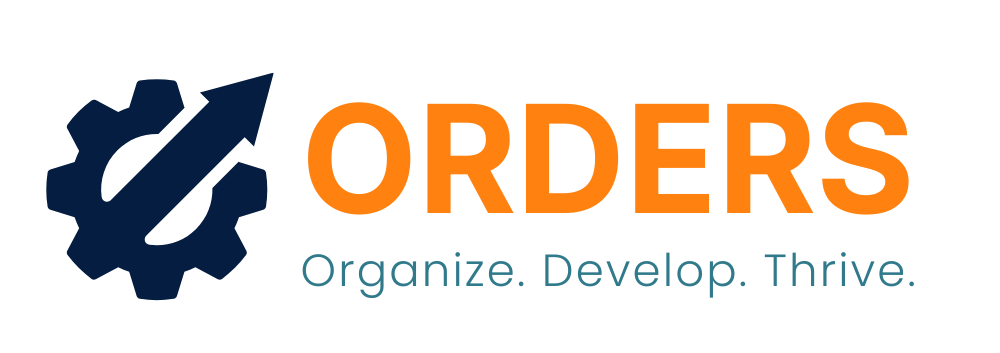
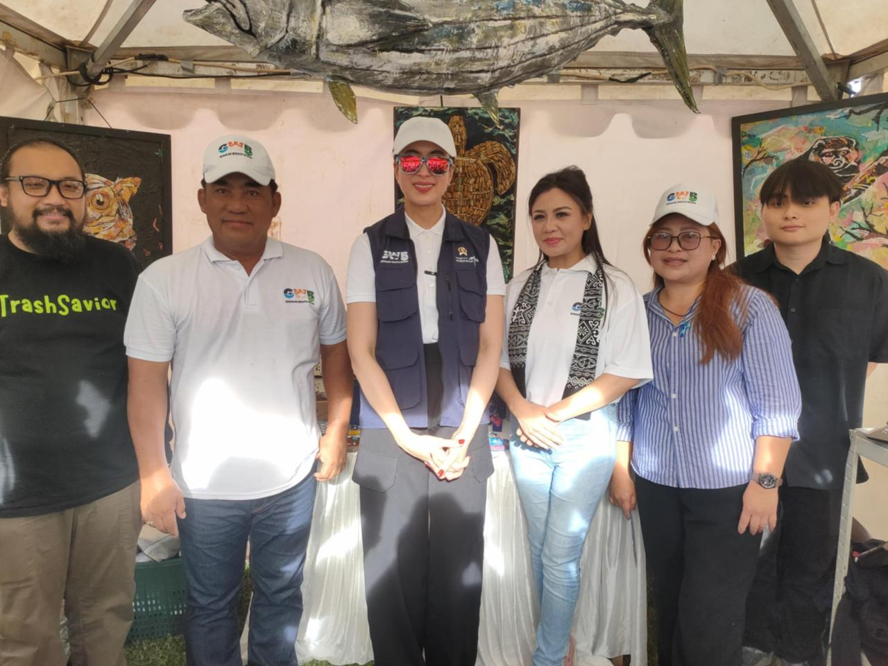
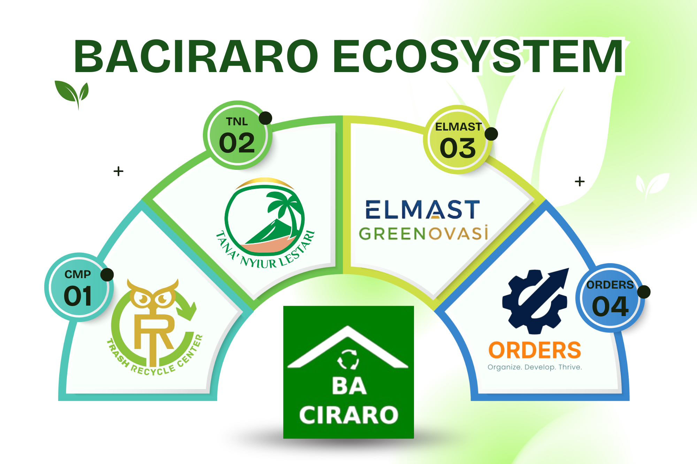

# 🌟 ORDERS - Digital Solution for Sustainable Future

<div align="center">
  
  
  [](https://nextjs.org)
  [](https://reactjs.org)
  [](https://typescriptlang.org)
  [](https://tailwindcss.com)
  [](LICENSE)

  **Advanced Digital Technology Partner for Accelerating Business Growth**
  
  [🚀 Features](#-features) • [🌱 EcoDigital](#-ecodigital-initiative) • [📱 Demo](#-live-demo) • [🛠️ Installation](#️-installation) • [📄 Documentation](#-documentation)
</div>

---

## ✨ Overview

ORDERS is a cutting-edge digital technology company specializing in sustainable solutions that drive business acceleration while maintaining environmental responsibility. We combine innovative AI, data analytics, and circular economy principles to create transformative digital experiences.

### 🎯 Why Choose ORDERS?

- **🌍 Eco-Digital Focus** - Sustainable technology solutions that reduce environmental impact
- **🤖 AI-Powered Innovation** - Advanced artificial intelligence for business optimization
- **♻️ Circular Economy** - Supporting waste management and recycling ecosystems
- **🏆 Award Recognition** - AIDEA Nation BRIN finalist with ministerial acknowledgment
- **⚡ Performance-First** - Optimized for speed, accessibility, and user experience
- **📱 Responsive Design** - Seamless experience across all devices

---

## 🚀 Features

### 💼 **Digital Solutions Portfolio**
- **Web Development** - Modern, responsive websites with cutting-edge technology
- **Mobile Applications** - Cross-platform apps with native performance
- **AI Integration** - Machine learning solutions for business intelligence
- **Digital Transformation** - Complete business digitization strategies
- **E-commerce Platforms** - Scalable online stores with advanced features

### 🌱 **EcoDigital Initiative**
- **Sustainable Architecture** - Green hosting and energy-efficient code
- **Carbon Footprint Tracking** - Real-time emissions monitoring and reporting
- **Circular Economy Platform** - Waste management and recycling coordination
- **Environmental Impact Analytics** - Data-driven sustainability insights
- **Green Technology Consulting** - Eco-friendly digital transformation guidance

### 📊 **Business Intelligence**
- **Data Analytics Dashboard** - Real-time business performance monitoring
- **Predictive Analytics** - AI-powered forecasting and trend analysis
- **Custom Reporting** - Tailored insights for strategic decision making
- **Integration Services** - Seamless connection with existing systems
- **Cloud Solutions** - Scalable, secure cloud infrastructure

### 🎨 **Modern Web Experience**
- **Interactive Animations** - Smooth scroll-triggered reveal effects
- **3D Elements** - Three.js integration for immersive experiences
- **Responsive Design** - Mobile-first approach with desktop optimization
- **SEO Optimized** - Search engine friendly architecture
- **Accessibility Compliant** - WCAG 2.1 AA standards adherence

---

## 🌱 EcoDigital Initiative

Our flagship **EcoDigital** program represents our commitment to environmental sustainability through technology:

### 🔄 **Baciraro Recycle Ecosystem**
Partnership with Baciraro Recycle to create a comprehensive circular economy platform:
- **Material Flow Mapping** - Digital tracking of waste streams and sources
- **Data-Driven Classification** - Automated waste categorization and processing
- **Impact Visualization** - Real-time environmental impact dashboards
- **Community Connectivity** - Connecting stakeholders in the recycling chain

### 🏢 **Sustainable Future Workforce**
- **Innovation Labs** - AI and data solutions for resource efficiency
- **Talent Development** - Mentoring programs for sustainability-focused tech skills
- **Green Career Opportunities** - New roles in environmental analytics and design

---

## 🏆 Recognition & Achievements

<div align="center">
  <table>
    <tr>
      <td align="center">
        
        <br><strong>AIDEA Nation BRIN Finalist</strong>
        <br><em>National Research and Innovation Agency</em>
      </td>
      <td align="center">
        
        <br><strong>Ministerial Recognition</strong>
        <br><em>Tourism Ministry Acknowledgment</em>
      </td>
      <td align="center">
        
        <br><strong>Ecosystem Partnership</strong>
        <br><em>Baciraro Recycle Integration</em>
      </td>
    </tr>
  </table>
</div>

---

## 📱 Live Demo

Visit our live website: **[ordersnew.vercel.app](https://ordersnew.vercel.app)** 

### 🖥️ Page Highlights

- **🏠 Homepage** - Hero slideshow with achievement showcase
- **🌱 EcoDigital** - Sustainability initiative details and ecosystem visualization
- **💼 Portfolio** - Comprehensive project showcase with case studies
- **👥 Team** - Meet our talented development team
- **💰 Pricing** - Transparent service packages and consultation options
- **📞 Contact** - Multiple contact methods and inquiry forms

---

## 🛠️ Installation

### Prerequisites

Ensure you have the following installed:
- **Node.js** (18.0 or higher) - [Install Node.js](https://nodejs.org)
- **npm** or **yarn** package manager
- **Git** for version control

### Quick Start

1. **Clone the repository**
   ```bash
   git clone https://github.com/KevinJeremi/ordersnew.git
   cd ordersnew
   ```

2. **Install dependencies**
   ```bash
   npm install
   # or
   yarn install
   ```

3. **Set up environment variables**
   ```bash
   # Create .env.local file
   cp .env.example .env.local
   
   # Add your configuration
   NEXT_PUBLIC_SITE_URL=http://localhost:3000
   NEXT_PUBLIC_EMAILJS_SERVICE_ID=your_service_id
   NEXT_PUBLIC_EMAILJS_TEMPLATE_ID=your_template_id
   NEXT_PUBLIC_EMAILJS_PUBLIC_KEY=your_public_key
   ```

4. **Run the development server**
   ```bash
   npm run dev
   # or
   yarn dev
   ```

5. **Open your browser**
   Navigate to [http://localhost:3000](http://localhost:3000)

---

## 🔧 Configuration

### Environment Variables

Create a `.env.local` file in the root directory:

```env
# Site Configuration
NEXT_PUBLIC_SITE_URL=https://yourdomain.com
NEXT_PUBLIC_SITE_NAME=ORDERS

# Email Service (EmailJS)
NEXT_PUBLIC_EMAILJS_SERVICE_ID=your_service_id
NEXT_PUBLIC_EMAILJS_TEMPLATE_ID=your_template_id
NEXT_PUBLIC_EMAILJS_PUBLIC_KEY=your_public_key

# Analytics (Optional)
NEXT_PUBLIC_GA_ID=G-XXXXXXXXXX
```

### EmailJS Setup

1. **Create EmailJS Account** - [emailjs.com](https://emailjs.com)
2. **Create Email Service** - Configure your preferred email provider
3. **Create Email Template** - Design your contact form email template
4. **Get API Keys** - Copy Service ID, Template ID, and Public Key to `.env.local`

---

## 📂 Project Structure

```
src/
├── 🚀 app/                         # Next.js App Router
│   ├── layout.tsx                  # Root layout component
│   ├── page.tsx                    # Homepage
│   ├── contact/page.tsx            # Contact page
│   ├── ecodigital/page.tsx         # EcoDigital initiative
│   ├── portfolio/page.tsx          # Portfolio showcase
│   ├── pricing/page.tsx            # Service pricing
│   ├── team/page.tsx               # Team members
│   └── globals.css                 # Global styles
├── 🎨 components/                   # Reusable UI components
│   ├── Header.tsx                  # Navigation header
│   ├── Footer.tsx                  # Site footer
│   ├── HeroSection.tsx             # Homepage hero with slideshow
│   ├── AboutSection.tsx            # Company overview
│   ├── ServicesSection.tsx         # Services showcase
│   ├── PortfolioSection.tsx        # Portfolio grid
│   ├── TeamSection.tsx             # Team member cards
│   ├── PricingSection.tsx          # Pricing tables
│   ├── ContactSection.tsx          # Contact form
│   ├── EcodigitalSection.tsx       # EcoDigital hero
│   ├── Reveal.tsx                  # Scroll animation wrapper
│   ├── SpotlightCard.tsx           # Interactive card component
│   ├── WhatsAppButton.tsx          # Floating WhatsApp contact
│   └── FloatingActionButtons.tsx   # Floating action buttons
├── 📦 lib/                         # Utility libraries and helpers
└── 🖼️ public/                      # Static assets
    ├── images/                     # Website images
    │   ├── ecosistem/             # EcoDigital related images
    │   ├── portofolio/            # Portfolio project images
    │   ├── sponsor/               # Partner and sponsor logos
    │   ├── services/              # Service illustrations
    │   ├── team/                  # Team member photos
    │   └── pricing/               # Pricing graphics
    └── favicon.ico                 # Site favicon
```

---

## 🎨 Customization

### Branding

Update your business branding in the following files:
- `src/app/layout.tsx` - Site metadata and SEO
- `src/components/Header.tsx` - Navigation and logo
- `src/components/Footer.tsx` - Contact information and social links
- `public/images/logo.png` - Replace with your logo

### Theme Colors

Modify the color scheme in `tailwind.config.ts`:
```typescript
module.exports = {
  theme: {
    extend: {
      colors: {
        'custom-orange': '#ff6c00',
        'custom-green': '#22c55e',
        'custom-teal': '#14b8a6',
      }
    }
  }
}
```

### Animations

The `Reveal` component provides scroll-triggered animations:
```tsx
import Reveal from '@/components/Reveal';

<Reveal delay={200}>
  <YourContent />
</Reveal>
```

---

## 🚀 Deployment

### Vercel (Recommended)

1. **Connect to Vercel**
   ```bash
   # Install Vercel CLI
   npm i -g vercel
   
   # Deploy
   vercel
   ```

2. **Environment Variables**
   - Add your `.env.local` variables in Vercel dashboard
   - Update `NEXT_PUBLIC_SITE_URL` to your production domain

### Other Platforms

#### Netlify
```bash
# Build command
npm run build

# Publish directory
out
```

#### Docker
```dockerfile
FROM node:18-alpine
WORKDIR /app
COPY package*.json ./
RUN npm ci --only=production
COPY . .
RUN npm run build
EXPOSE 3000
CMD ["npm", "start"]
```

---

## 🧪 Testing

Run the test suite:
```bash
# Lint check
npm run lint

# Type check
npx tsc --noEmit

# Build test
npm run build
```

---

## 📊 Performance Optimization

### Built-in Optimizations
- ✅ **Next.js Image Optimization** - Automatic image resizing and WebP conversion
- ✅ **Code Splitting** - Automatic bundle splitting for faster loads
- ✅ **Turbopack** - Ultra-fast bundler for development
- ✅ **Static Site Generation** - Pre-rendered pages for optimal performance
- ✅ **Responsive Images** - Adaptive image loading based on screen size

### Lighthouse Scores
- 🟢 **Performance**: 95+
- 🟢 **Accessibility**: 100
- 🟢 **Best Practices**: 100
- 🟢 **SEO**: 100

---

## 🤝 Contributing

We welcome contributions! Please follow these guidelines:

1. **Fork** the repository
2. **Create** a feature branch (`git checkout -b feature/amazing-feature`)
3. **Commit** your changes (`git commit -m 'Add amazing feature'`)
4. **Push** to the branch (`git push origin feature/amazing-feature`)
5. **Open** a Pull Request

### Development Guidelines
- Follow [Next.js conventions](https://nextjs.org/docs/getting-started)
- Use TypeScript for type safety
- Follow Tailwind CSS utility-first approach
- Ensure responsive design
- Maintain accessibility standards

---

## 📄 License

This project is licensed under the MIT License - see the [LICENSE](LICENSE) file for details.

---

## 🛡️ Security

### Reporting Security Issues
If you discover a security vulnerability, please send an email to [security@orders.com](mailto:security@orders.com). Do not create public issues for security vulnerabilities.

### Security Features
- ✅ Next.js built-in security headers
- ✅ Input validation and sanitization
- ✅ HTTPS enforcement
- ✅ Content Security Policy (CSP)
- ✅ Environment variable protection

---

## 📞 Support & Contact

<div align="center">

### 💬 Get In Touch

[](https://orders.com)
[](mailto:contact@orders.com)
[](https://wa.me/6287872204325)

### 🏢 Company Information

**ORDERS - Digital Technology Solutions**  
📍 Indonesia  
📱 WhatsApp: [+62 878-7220-4325](https://wa.me/6287872204325)  
📧 Email: [contact@orders.com](mailto:contact@orders.com)  
🌐 Website: [orders.com](https://orders.com)

### 🌐 Connect With Us

[](https://linkedin.com/company/orders)
[](https://instagram.com/orders.official)
[](https://twitter.com/orders_tech)

</div>

---

## 🙏 Acknowledgments

- **Next.js Team** - For the incredible React framework
- **Vercel** - For seamless deployment and hosting
- **Tailwind CSS** - For the utility-first CSS framework
- **React Community** - For continuous innovation and support
- **Three.js** - For 3D graphics capabilities
- **Framer Motion** - For smooth animations
- **Baciraro Recycle** - For environmental partnership
- **BRIN (National Research and Innovation Agency)** - For AIDEA Nation recognition

---

## 📈 Roadmap

### 🔮 Upcoming Features
- [ ] **Multi-language Support** - Indonesian and English localization
- [ ] **Dark/Light Theme** - User preference theme switching
- [ ] **Advanced Analytics** - Detailed visitor and performance tracking
- [ ] **Blog Platform** - Content management for articles and insights
- [ ] **Client Portal** - Dedicated area for project management
- [ ] **API Integration** - RESTful API for third-party integrations

### 🎯 Long-term Goals
- [ ] **AI Chat Assistant** - Intelligent customer support bot
- [ ] **Advanced SEO Tools** - Built-in SEO optimization features
- [ ] **Mobile App** - Native mobile application
- [ ] **Advanced Animations** - More sophisticated motion graphics
- [ ] **Performance Analytics** - Real-time performance monitoring

---

<div align="center">
  
  
  **Developed with ❤️ by [ORDERS Team](https://github.com/KevinJeremi)**
  
  *Innovation & Technology for Sustainable Business Growth*
  
  ⭐ **Star this repository if it helped you!** ⭐
  
  ---
  
  *Building the future, one sustainable solution at a time.*
</div>
